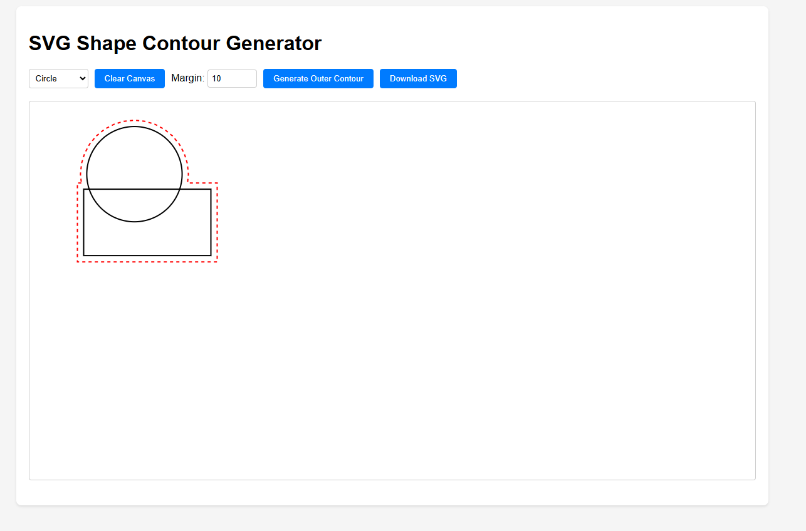

# SVG Shape Contour Generator

An interactive web application that allows users to draw shapes and automatically generate an outer contour around them. Built with Flask, SVG.js, and Shapely.


*Screenshot: A circle and rectangle with a red dashed contour line around them, demonstrating the contour generation feature with a 10px margin.*

## Features

- Interactive drawing canvas for creating shapes
- Support for rectangles and circles
- Real-time shape drawing with click-and-drag
- Adjustable margin for the outer contour
- Automatic contour generation around all shapes
- SVG export functionality
- Clean and modern user interface

## Technologies Used

### Frontend
- SVG.js (v3.1.1) for vector graphics manipulation
- HTML5 for structure
- CSS3 for styling
- JavaScript for interactivity

### Backend
- Flask for the web server
- Shapely for geometric operations
- svgpathtools for SVG path manipulation
- NumPy for numerical computations

## Setup

1. Create and activate a virtual environment (recommended):
```bash
python -m venv venv
# On Windows:
venv\Scripts\activate
# On macOS/Linux:
source venv/bin/activate
```

2. Install Python dependencies:
```bash
pip install -r requirements.txt
```

3. Run the Flask application:
```bash
python app.py
```

4. Open your web browser and navigate to:
```
http://localhost:5000
```

## Usage

1. Drawing Shapes:
   - Select shape type (Rectangle or Circle) from the dropdown menu
   - Click and drag on the canvas to draw
   - Release mouse button to complete the shape

2. Generating Contours:
   - Draw multiple shapes on the canvas
   - Adjust the margin value (default: 10)
   - Click "Generate Outer Contour" to create a red dashed contour around all shapes

3. Managing Canvas:
   - Use "Clear Canvas" to remove all shapes and contours
   - Click "Download SVG" to save your work as an SVG file

## Implementation Details

### Frontend
- Uses SVG.js for vector graphics manipulation
- Implements real-time shape drawing with mouse events
- Manages shape collection and contour visualization
- Handles SVG export functionality

### Backend
- Flask server provides REST API endpoints
- Uses Shapely for geometric operations:
  - Converting shapes to polygons
  - Computing shape unions
  - Generating contour buffers
- Converts geometric data to SVG path format

## Requirements

- Python 3.7+
- Flask
- svgpathtools
- shapely
- numpy
- Modern web browser with JavaScript enabled

## License

MIT License 